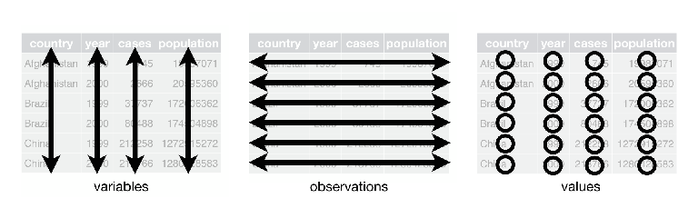
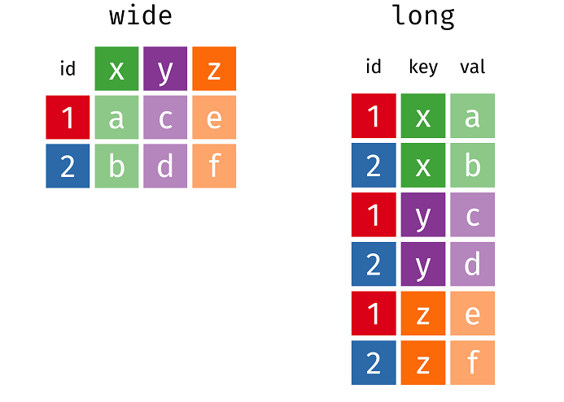
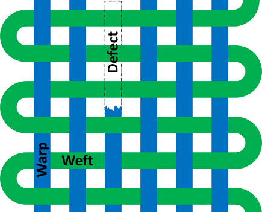
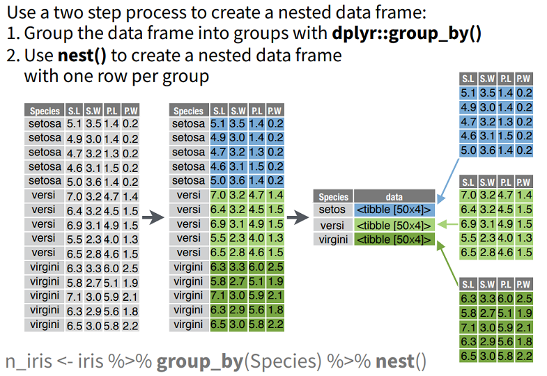

```{r setup, include=FALSE}
library(learnr)
knitr::opts_chunk$set(echo = TRUE)
```

## Introduction

This is a _shiny_ app built with the [`learnr`](https://rstudio.github.io/learnr/) package from Rstudio, which makes it quick and easy to build a tutorial using markdown.

This app runs through some examples to demonstrate the new version of [`tidyr`](https://tidyr.tidyverse.org/) using material adapted from the documentation and vignettes for `tidyr`. The original documenation is more detailed - check it out!

```{r eval=FALSE}
?`tidyr-package`
```

The markdown used to produce this app can be found on github [here](https://github.com/DataS-DH/RCC-tidyr-learnr).

## What is [`tidyr`](https://tidyr.tidyverse.org/) and why is it useful?


We talk a lot about, and recommend the [`tidyverse`](https://www.tidyverse.org) set of R packages. 

The `tidyverse` is designed to work with tidy data.

The [`tidyr`](https://tidyr.tidyverse.org/) package provides you with the tools to reshape and reorganise data to make it tidy. `tidyr` has just had its [1.0.0 release](https://www.tidyverse.org/articles/2019/09/tidyr-1-0-0/). This is a significant milestone indicating that it has reached a certain level of maturity. 

It also comes with some new and improved functionality which we will explore.

## What is [`learnr`](https://rstudio.github.io/learnr/) and why use it?

This shiny app has been put together using the [`learnr`](https://rstudio.github.io/learnr/) package which makes it easy to build interactive tutorials. ([Check out the examples.](https://rstudio.github.io/learnr/index.html#examples))

This has been done partly so I can learn about `learnr`, but also so that the session is a little more interesting and interactive for you.

As there is no sensitive information in this app it has been deployed using the free version of shinyapps.

Most of the content has been borrowed from the `tidyr` documentation. Take a look!

## Housekeeping

### Make Sure you Have tidyr 1.0.0

Since this app is all about the new features in `tidyr` 1.0.0 you probably want to make sure you have it installed!

```{r warning=FALSE}
library(tidyr) # load tidyr
sessionInfo()$otherPkgs$tidyr$Version # check version using sessioninfo
```

If you dont have `tidyr`, or have an older version you can update using `install.packages('tidyr')`.

### Breaking Changes

There are a small number of breaking chnges vs the previous version of tidyr. If you use `tidyr` regularly, in particular the `nest`/`unnest` functions, you may want to take a look at the [changelog](https://github.com/tidyverse/tidyr/releases) before updating.


### Load Other Packages

As well as tidyr we are going to use a few other packages for the examples:
```{r load_other_packages, message=FALSE, warning=FALSE}
library(dplyr)    # used for pipe (%>%), mutate(), arrange() and glimpse()
library(stringr)  # used for some data tidying
```


### Data Sources

tidyr comes with some built in data which we will use in the tutorial. We will also use some example data from the `repurrrsive` package. You can see the data inculded with a package using the `data()` function, for example: `data(package = 'tidyr')`

```
billboard                      Song rankings for billboard top 100 in the year 2000
construction                   Completed construction in the US in 2018
fish_encounters                Fish encounters
population                     World Health Organization TB data
relig_income                   Pew religion and income survey
smiths                         Some data about the Smith family
table1                         Example tabular representations
table2                         Example tabular representations
table3                         Example tabular representations
table4a                        Example tabular representations
table4b                        Example tabular representations
table5                         Example tabular representations
us_rent_income                 US rent and income data
who                            World Health Organization TB data
world_bank_pop                 Population data from the world bank
```
### Tibbles?
Going through this tutorial you might see `tibble` referred to.

For the purposes of this tutorial, you can just think tibble = data.frame.

A `tibble` is a tidyverse version of base R's `data.frame`. Tibbles are implemented in the `tibble` package which is then imported by `dplyr` and `tidyr` (and many other packages)

For more info you can run:
```{r eval = FALSE}
?tibble::tibble
```


## Describing Data

Before we dive into using `tidyr` to tidy data, it is useful to remind ourselves what tidy data looks like, and the vocabulary we use to describe it.

### Rows & Columns

Most statistical datasets are data frames made up of **rows** and **columns**. The columns are almost always labeled and the rows are sometimes labeled. 

The following code provides some data about an _imaginary_ experiment in a format commonly seen in the wild. The table has two columns and three rows, and both rows and columns are labeled.

```{r}
preg <- read.csv("data/preg.csv", stringsAsFactors = FALSE)
preg
```

### Other Structures
There are many ways to structure the same data. The following table shows the same data as above, but the rows and columns have been transposed.

```{r echo=TRUE}
read.csv("data/preg2.csv", stringsAsFactors = FALSE)
```

The data is the same, but the layout is different. Our vocabulary of rows and columns is simply not rich enough to describe why the two tables represent the same data. 

We need a better way to describe the values displayed in the table.

### Values, Variables and Observations

A dataset is a collection of **values**, usually either numbers (if quantitative) or strings (if qualitative). 

Values are organised in two ways. Every value belongs to a **variable** and an **observation**: 

* A **variable** contains all values that measure the same underlying attribute (like a height, temperature or duration) across units. 
* An **observation** contains all values measured on the same unit (like a person, or a day, or a race) across attributes.

<center>

</center>


### Tidy Data

A tidy version of the pregnancy data looks like this: 

```{r}
preg_tidy <- preg %>% 
  pivot_longer(treatmenta:treatmentb, names_to = "treatment", values_to = "n") %>% 
  mutate(treatment = str_remove(treatment, "treatment")) %>%
  arrange(name, treatment)
preg_tidy
```

This makes the values, variables and observations more clear. In this case our _observation_ is an imaginary test of a treatment. 

The dataset contains 18 values representing three _variables_ and six _observations._ The _variables_ are:

1. `name`, with three possible values (John, Mary, and Jane).

2. `treatment`, with two possible values (a and b).

3. `n`, with five or six values depending on how you think of the missing 
   value (`r sort(preg_tidy$n, na.last = TRUE)`)


### Observation or Variable?

For a given dataset, it's usually easy to figure out what are observations and what are variables, but it is surprisingly difficult to precisely define _variables_ and _observations_ in general. 

For example, if the columns in the pregnancy data were `height` and `weight` we would have been happy to call them variables. 

| Person 	| Height 	| Weight 	|
|:-------:|:-------:|:-------:|
| Jo     	| 170    	| 58     	|

If the columns were `height` and `width`, it would be less clear cut, as we might think of height and width as values of a `dimension` variable. 

| Person 	| Dimension 	| cm  	|
|:-------:|:-----------:|:-----:|
| Jo     	| Height    	| 170 	|
| Jo     	| Width     	| 40  	|

So in the first case we have one observation of `person` with variables of `height` and `weight`.
While in the second case we have two observations of `measurement` with variables of dimension and `cm`. Note - if the dimensions. 

### Rule of Thumb

When deciding which structure to use, remember it is usually easier to:

* describe functional relationships between variables (columns) than between rows, 
* make comparisons between groups of observations (rows) than between groups of columns.

## Messy Datasets

Real datasets are messy. 

Occasionally you get a dataset that you can start analysing immediately, this is the exception, not the rule. 

The following sections look at some common types of messy data and how to tidy them with a small set of tools: 

* Separating combined variables using `separate()`
* Pivoting (longer and wider) using `pivot_longer()` and `pivot_wider()`

### Long and Wide

We often use the terms wide and long to refer to different presentations of the same data:



The following animation goes from one to the other: 


The creators have more [here](https://github.com/batpigandme/tidyexplain/). They are made in R using the [`gganimate`](https://gganimate.com/) package.

## Tidying: Column Headers to Values

A common type of messy dataset is cross-tabulated data designed for presentation; both the rows and columns are variables

In some cases this can be useful, in general though, its harder to work with than 'tidy' data.

The following code shows a subset of a typical dataset of this form. This dataset explores the relationship between income and religion in the US. 

```{r}
relig_income
```

This dataset has three variables:

* `religion`
* `income` 
* `frequency`

To tidy it, we need to **pivot** the non-variable columns (i.e. the columns representing different _levels_ of income <\$10k, \$10-20k, etc ) into a two-column key-value pair (income & frequency). This action is often described as making a wide dataset _longer_ (or taller). 


### Pivoting Longer

When pivoting variables, we need to define:

* the columns to pivot ( in this case, every column except for religion)
* the name of the new key-value columns to create. (keys: `income` values: `frequency`). 
Have a go:

```{r longer_income, exercise=TRUE }
relig_income %>% 
  pivot_longer(            , # column selection
               names_to =  , # column to put names in  
               values_to =  ) # column to put values in 
```

```{r longer_income-solution}
relig_income %>% 
  pivot_longer(-religion, 
               names_to = "income", 
               values_to = "frequency")
```

This form is tidy because each column represents a _variable_ and each row represents an _observation_, in this case a demographic unit corresponding to a combination of `religion` and `income`.

## Tidying: Separating Combined Variables

Sometimes the key column is a combination of _multiple_ underlying variables. 

This happens in the `tb` (tuberculosis) dataset, shown below. This dataset comes from the World Health Organisation, and records the counts of confirmed tuberculosis cases by `country`, `year`, and demographic group.

The demographic groups are broken down by:

* `sex` (m, f) 
* `age` (0-14, 15-25, 25-34, 35-44, 45-54, 55-64, unknown).

```{r}
tb <- as_tibble(read.csv("data/tb.csv", stringsAsFactors = FALSE))
tb
```

### Convert From Column Headings to Variable

First we use `pivot_longer()` to gather up the non-variable columns:

```{r longer-tb, exercise = TRUE}
tb2 <- tb %>% 
  pivot_longer(
                ,          # column selection
    names_to =  ,          # key column name
    values_to = ,          # values column name
    values_drop_na =       # drop NA rows?
  )
tb2
```

```{r longer-tb-solution}
tb2 <- tb %>% 
  pivot_longer(
    c(-iso2, -year), 
    names_to = "demo", 
    values_to = "n", 
    values_drop_na = TRUE
  )
tb2
```

### Separate Combined Variables

Column headers in this format are often separated by a non-alphanumeric character (e.g. `.`, `-`, `_`, `:`), or have a fixed width format, like in this dataset. `separate()` makes it easy to split a compound variables into individual variables. 

You can either pass it a _regular expression_ to split on (the default is to split on non-alphanumeric columns), or a vector of character positions. In this case we want to split after the first character so try using a number:

```{r tb-separate, exercise = TRUE}
tb3 <- tb2 %>% 
  separate(col =  ,   # column to split
           into = ,   # names of new columns
           sep =    ) # position or regex
tb3
```

```{r tb-separate-solution}
tb3 <- tb2 %>% 
  separate(col = demo, 
           into = c("sex", "age"), 
           sep = 1)
tb3
```

Storing the values in this form resolves some potential issues with the original data by making the gender and age variables explicit and separate. This means you could:

* Join on a population variable and calculate rates,
* Produce a summary by age group or gender and do comparisons.

### Using a Regular Expression

In this case, we could also do the transformation in a single step by supplying multiple column names to `names_to` and also supplying a grouped regular expression to `names_pattern`.

We want a regular expression that captures the m/f in the first group, and everythig else in the second.
For a hint - look at [this regexr example](http://regexr.com/4lqpj).

```{r pivot_regex, exercise = TRUE}
tb %>% pivot_longer(
  c(-iso2, -year), 
  names_to = c("sex", "age"), 
  names_pattern = "<regular expression here>",  
  values_to = "n", 
  values_drop_na = TRUE
)
```

```{r pivot_regex-solution}
tb %>% pivot_longer(
  c(-iso2, -year), 
  names_to = c("sex", "age"), 
  names_pattern = "(.)(.+)",  # splits 
  values_to = "n", 
  values_drop_na = TRUE
)
```

## Tidying: Variables in Rows & Cols

The most complicated form of messy data occurs when variables are stored in both rows and columns. 

The code below loads daily weather data from the Global Historical Climatology Network for one weather station (MX17004) in Mexico for five months in 2010. 

It has variables in individual columns (`id`, `year`, `month`), spread across columns (`day`, d1-d31) and across rows (`tmin`, `tmax`) (minimum and maximum temperature). Months with fewer than 31 days have missing values for the last day(s) of the month.

```{r}
weather <- as_tibble(read.csv("data/weather.csv", stringsAsFactors = FALSE))
weather
```


### Longer First

To tidy this dataset we first use `pivot_longer` to gather the day columns:

```{r}
weather2 <- weather %>% 
  pivot_longer(
    d1:d31, 
    names_to = "day", 
    values_to = "value"
  ) 
weather2
```

### Data Cleaning

We'll also do a little cleaning:

```{r}
weather3 <- weather2 %>% 
  mutate(day = as.integer(str_remove(day, "d"))) %>%
  select(id, year, month, day, element, value)
weather3
```

This dataset is mostly tidy, but the `element` column is not a variable; it stores the names of variables. (Not shown in this example are the other meteorological variables `prcp` (precipitation) and `snow` (snowfall)).

### Then Wide Again

Fixing this requires widening the data: `pivot_wider()` is inverse of `pivot_longer()`, pivoting `element` and `value` back out across multiple columns:

```{r pivot_wide_weather, exercise = TRUE}
weather3 %>% 
  pivot_wider(names_from = ,  # column with variable names
              values_from = ) # column with values
```

```{r pivot_wide_weather-solution}
weather3 %>% 
  pivot_wider(names_from = element, 
              values_from = value)
```

This form is tidy: there's one variable in each column, and each row represents one day.


## Aggregating

Sometimes, long/tall data can have multiple values with the same labels identifying

The `warpbreaks` dataset gives the number of warp breaks per loom, where a loom corresponds to a fixed length of yarn.



The important thing to note, is that there are multiple break values for each type of wool and tension:

```{r}
head(warpbreaks)
```

### Spread
If we attempt to use the older `spread` function (from previous versions of `tidyr`) on this we would get an error:

```{r spread_error, exercise = TRUE}
warpbreaks %>% spread(key = tension, 
                      value = breaks)
```

`spread` is complaining that it doesnt know where to put all the values because there are multiple break numbers for each value of tension.

### Lists

`pivot_wider` is a bit cleverer:

```{r pivot_wide_list, exercise = TRUE}
warpbreaks %>% pivot_wider(names_from = tension,
                           values_from = breaks)
```

Instead of an _error_, we get a _warning_ telling us that `pivot_wider` has put lists in the output where there are multiple values.

### Aggregating

This is useful, but perhaps more usefully, you can provide `pivot_wider` with a function and it will use it to _summarise_ these lists, for example by counting the entities or summing them:

```{r pivot_wide_agg, exercise = TRUE}
warpbreaks %>% pivot_wider(names_from = tension,
                           values_from = breaks,
                           values_fn = list(breaks = sum))
```

So - you can use the pivot functions to aggregate!

## Rectangling

So far we have looked at different ways that `tidyr` can help us pivot data between rows and columns

Sometimes the problem isn the way that the data is laid out in 2D, but its structure - i.e. what if thre is nesting going on and there are lists inside your data frame?

This is a common situation when you do web scraping or get data back from an API.

The `repurrsive` package has a couple of examples of nested data:

```{r}
library(repurrrsive)
```

We are going to use one called `gh_users` which is a nested list, i.e. a list made up of lists.

From `?gh_users`:

>Each component of the list represents a GitHub user. Each user's component is a list of length 30, containing information such as username, GitHub id, and join date.

Use `glimpse` to a look at the contents of the first item in `gh_users` and verify this:
```{r gh-users-glimpse, exercise = TRUE}
gh_users
```

```{r gh-users-glimpse-solution}
glimpse(gh_users[[1]])
```

So the structure is like this:

* gh_users
    * User 1
        * Property 1
        * Property 2
        * ...
    * User 2
        * Property 1
        * Property 2
        * ...
    * User ...
        

### Enter tidyr

`tidyr` is designed to work with data frames, so the first thing we do is to turn this into one.

Use the `tibble` function to create a data frame where the `user` column contains the `gh_users` list, and use `glimpse` to take a look at it:
```{r tibble_create, exercise = TRUE}
users <- tibble( )
```

```{r tibble_create-solution}
users <- tibble(user = gh_users)

glimpse(users)
```

What we have created is data.frame (tibble) containing a 'list column'. The data frame has 1 row for each item in the `gh_users` list and 1 column, where each cell in that column contains a list.

### Unnesting - Wider

What we want, is columns for each of the items in the lists sitting in the cells of our list column.

There are two ways to turn the list components into columns. `unnest_wider()` takes every component and makes a new column:

```{r unnesting_setup, include=FALSE}
users <- tibble(user = gh_users)
```

```{r unnest_wider, exercise = TRUE, exercise.setup = "unnesting_setup"}
users %>% unnest_wider(user)
```

### Unnesting - Hoist

But in this case, there are many components and we don't need most of them so we can instead use `hoist()`. `hoist()` allows us to pull out selected components (while keeping the rest as a list column):

```{r hoist, exercise = TRUE, exercise.setup = "unnesting_setup"}
users %>% 
  hoist(user,
        followers = "followers",
        login = "login",
        url = "html_url"
  )
```

`hoist()` removes the named components from the `user` list-column, so you can think of it as moving components out of the inner list into the top-level data frame. 

### Unnesting - Longer

The counterpart for `unnest_wider()` is `unnest_longer()`. For this we want a different example.

`repurrsive` has us covered, and includes `gh_repos`

> A unnamed list with 6 components, each itself a list of ~30 repos for a specific GitHub user. Each repo's component is a list of length ~68, containing information such as name, owner (a list), fork status, and creation date.

So something like:

* **User 1**
    * Repo 1
        * Property 1 
        * Property 2
        * ...
        * Property 68
    * Repo 2
        * Properties 1-68
    * ...
    * Repo 30
        * Properties 1-68
* **User 2**
    * Repo 1
        * Property 1
        * Property 2
        * ...
        * Property 68

We start off `gh_repos` similarly, by putting it in a tibble:

```{r}
repos <- tibble(repo = gh_repos)
repos
```

This time the elements of `user` are a list of repositories that belong to that user. 

These are observations, so should become new _rows_, so we use `unnest_longer()` rather than `unnest_wider()`.

```{r}
repos <- repos %>% unnest_longer(repo)
repos
```

This creates a dataframe with a repo column of length ~ 6 x 30 = 180. (some of the users dont have 30 repos.)

Then we can use `unnest_wider()` or `hoist()` to spread the repository properties out to columns:

```{r}
repos %>% 
  hoist(repo, 
        name = "name",
        login = c("owner", "login"), 
        watchers = "watchers_count")
```

Note the use of `c("owner", "login")`: this allows us to reach directly _two levels deep_ inside of a list:

* Data Frame
    * repo column
        * Property 1 (e.g. `name`)
        * Property 2 (e.g. `owner`)
            * **Sub Property 1** (e.g. `login`)
            * Sub Property 2
        * ...
        * Property 64 (e.g. `watchers_count`)
        
### hoist practice

For practice, have a go at rearranging the `sw_films` dataset so that there is a row per film, and columns for title, director and release data

```{r unnest_wide_practice, exercise = TRUE}
# Make a tibble / dataframe
sw_films_tibble <-

# use hoist to unnest it  
sw_films_unnested <-
  sw_films_tibble %>%
  hoist(
    
  )

# have a look at the result
glimpse(  )
```


```{r unnest_wide_practice-solution}
sw_films_tibble <- tibble(films = sw_films)

sw_films_unnested <- 
  sw_films_tibble %>%
  hoist(films,
        title = "title",
        director = "director",
        release_date = "release_date")

glimpse(sw_films_unnested)
```

## Nesting

While we have been talking about ways to 'rectangle' or flatten data, you might be thinking that it would be useful to go the other way, and do some nesting of your own.


### By Hand
You can manually create a nested data frame:

Here we take data frames of different size:
```{r}
item_1 <- tibble(x = 1, y = 2)
item_1
```

```{r}
item_2 <- tibble(x = 4:5, y = 6:7)
item_2
```

```{r}
item_3 <- tibble(x = 10)
item_3
```

... and nest them inside the data column of another data frame:
```{r}
df1 <- tibble(
  # col 1
  g = c(1, 2, 3),
  
  # col 2
  data = list(item_1, item_2, item_3)
)

df1
```

### From Existing Data

Its more likely that you would want to nest data that you already have, to make it a bit easer to work with.

Nesting can help you create something which is then easy to iterate over using the `map` functions. We learned about in `purrr` last time - see [here](https://github.com/DataS-DH/RCC-Iteration/blob/master/Iteration%20Presentation.pdf)

Its really easy:

  1) Use `dplyr::group_by` to identify what you want to nest by
  2) Use `tidyr::nest` to turn the groups into a nested list column
  
For example, to create a nested list column from `iris` grouped by species:
```{r}
n_iris <- 
  iris %>% 
  group_by(Species) %>% 
  nest()

n_iris
```

The same example more graphically:



This image is stolen from the `purrr` cheat sheet has an entire side on working with list columns - [check it out](https://github.com/rstudio/cheatsheets/blob/master/purrr.pdf).

