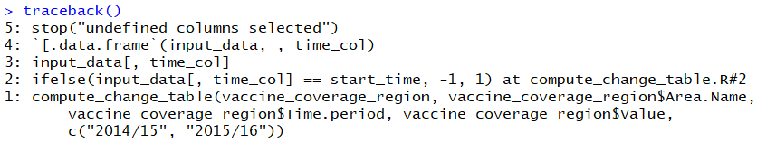
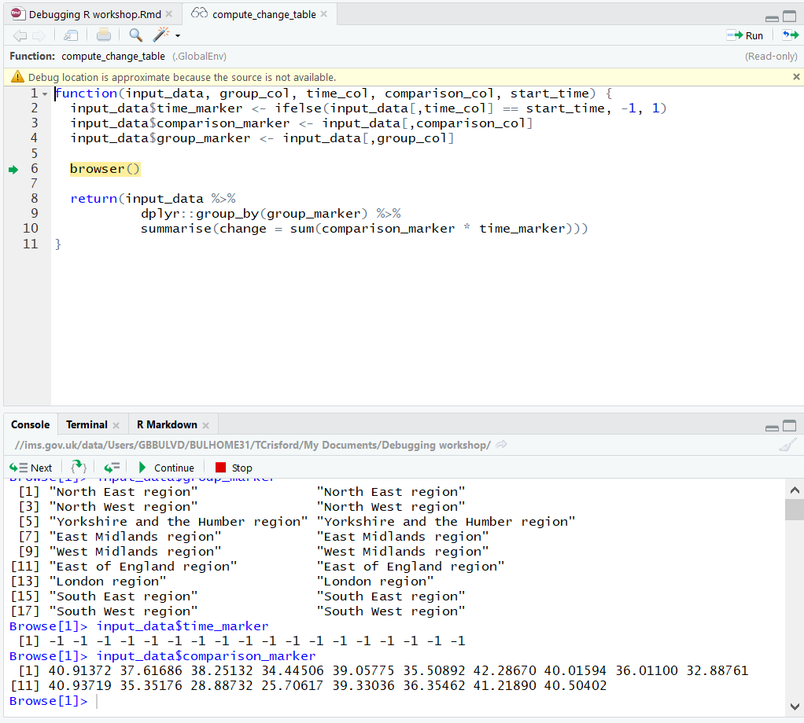
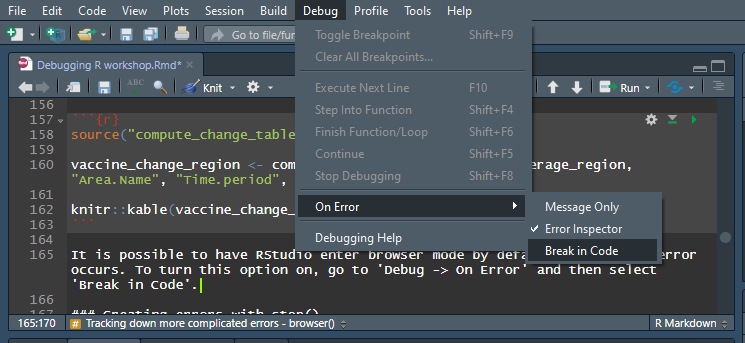

```{r setup, include=FALSE}
knitr::opts_chunk$set(echo = TRUE)
knitr::opts_chunk$set(error = TRUE)
library(dplyr)
library(knitr)
```

In this workshop we will cover:

- Interpreting error messages in R
- Investigating errors with traceback()
- Investigating errors with browser()
- Creating error messages with stop(...)
- Handling errors with try and tryCatch

### Straightforward error messages

When R displays an error message, usually the message will be clear enough that we can immediately work out what needs to be done to resolve the problem. For example, the following code chunk attempts to load a table of vaccine coverage among 2-4 year olds from a csv file.

```{r}
vaccine_coverage <- read.csv("303xviiipopulationvaccinationcoverageflu24yearsold.data.csv", stringsAsFactors = FALSE)
```

This message is telling us that the csv file we tried to open does not exist. We should therefore check whether the file name is correct. It wasn't. The csv file is actually stored in a sub-folder called 'data', inside the working directory, and R needs to be told this. Lets try again, and we'll then filter the table to only show the vaccine coverage in each region:

```{r}
vaccine_coverage <- read.csv("data/303xviiipopulationvaccinationcoverageflu24yearsold.data.csv", stringsAsFactors = FALSE)

vaccine_coverage_region <- dplyr::filter(vaccine_coverage, Area.Type == "Region") %>%
  dplyr::select(Area.Code, Area.Name, Time.period, Value) %>%
  dplyr::arrange(Area.Code)

knitr::kable(vaccine_coverage_region)
```

This time it works!

### Less clear error messages

Sometimes the error message that R prints will be less helpful. For example, suppose that instead of the code above, we try to filter the table without using the dplyr package, as follows:

```{r}
vaccine_coverage_region <- vaccine_coverage[vaccine_coverage$Area.Type == "Region"]
```

Here we are told "undefined columns selected". First, we should check what the column names are, to make sure 'Area.Type' really is the name of a column:

```{r}
print(colnames(vaccine_coverage))
```

It is. What else could be wrong? A good first thing to try is to copy and paste the full error message into google, and see if other people have had similar problems. Since the message here is very generic, you might add something else to the search as well. If we search for "undefined columns selected when filtering r" the top result explains what the issue is: https://stackoverflow.com/questions/19205806/undefined-columns-selected-when-subsetting-data-frame
We forgot a comma! If we want to select a subset of a data frame, we always need to include the comma. If we want all of the columns, we are just supposed to leave a blank space to the right of the comma.

The below code chunk correctly filters and sorts the table.

```{r}
vaccine_coverage_region <- vaccine_coverage[vaccine_coverage$Area.Type == "Region", ]

vaccine_coverage_region <- vaccine_coverage_region[order(vaccine_coverage_region$Area.Code), c("Area.Code", "Area.Name", "Time.period", "Value")]

knitr::kable(vaccine_coverage_region, row.names = FALSE)
```

Syntax errors, such as missing commas or brackets, can often produce strange error messages, so if you're confused it's always worth double checking these.

Note: We used 'colnames(...)' above to view the column names of a data frame, but a useful way of viewing all of the details of a data frame within RStudio is the 'View(...)' function. This will give you a spreadsheet-like view of the data frame's contents.

### Tracking down more complicated errors - traceback()

Sometimes, it might not be immediately clear which part of the code has caused an error message.

We now have a table of flu vaccine coverage among 2-4 year olds in each region, at two different time periods. Suppose we try to calculate the change in vaccine coverage in each region between the two time periods.

Someone tells us that they have written a custom function for doing this kind of calculation on an arbitrary table, and this function is stored in a different R script, called 'compute_change_table.R'.

They tell us that to use the custom function, its first argument should be the full table, its second should be the column that we want to group by (in this case region), the third should be the column which denotes the time period, the fourth should be the column we want to find the change in, and the fifth should tell the function what the time periods are called.

So we try to run it below:

```{r}
source('compute_change_table.R')

vaccine_change_region <- compute_change_table(vaccine_coverage_region, vaccine_coverage_region$Area.Name, vaccine_coverage_region$Time.period, vaccine_coverage_region$Value, c("2014/15", "2015/16"))
```

It is not immediately obvious what has caused this error message. Something has gone wrong inside the custom function, but we're not sure how that function works or what line this has happened on.

A useful tool here is 'traceback()'. This does not work within a markdown document, but after an error message is generated, if you type 'traceback()' into the console and press enter, you will see something like the below:



Traceback tells you exactly where the error occurred. The bottom line always tells you the part of your code that caused the problem. In this case, it was the part where we called the 'compute_change_table' function.

The next line up is more useful. It tells us which part of that function the error occurred in. To see where this error happened, we now know that we need to open 'compute_change_table.R' and go to line 2. Specifically, the error is generated when we try to select a column of the data frame 'input_data' given by a variable called 'time_col'. Lets look at the full contents of this file to see if we can work out what is going on:

```{r}
#compute_change_table.R

compute_change_table <- function(input_data, group_col, time_col, comparison_col, start_time) {
  input_data$time_marker <- ifelse(input_data[,time_col] == start_time, -1, 1)
  input_data$comparison_marker <- input_data[,comparison_col]
  input_data$group_marker <- input_data[,group_col]
  return(input_data %>%
           dplyr::group_by(group_marker) %>%
           summarise(change = sum(comparison_marker * time_marker)))
}
```

We can see that input_data was the first argument given to the function, in this case the full table 'vaccine_coverage_region'. time_col was the third argument. This reveals the problem. We sent the entire column to the function as the third argument, but if we look at the way it's being used, what is needed here is the *name* of the column. Lets try again:

```{r}
vaccine_change_region <- compute_change_table(vaccine_coverage_region, "Area.Name", "Time.period", "Value", c("2014/15", "2015/16"))

knitr::kable(vaccine_change_region)
```

This time we've had no error messages...

### Tracking down more complicated errors - browser()

...but the results clearly don't look right still, so there is still a problem! We're going to need to take a closer look under the hood of the function to see what's going on. To understand what the function is doing it's helpful to see what each of the variables actually are.

One thing we could do is add lines to the function to print the variables we want to see, so if we want to see x, we add the line print(x) at the point in the code where we'd like to see it. Then when we try re-running the code we can see what x is by looking at the output.

But an even more useful tool is 'browser()'. We can edit the R file, so that 'browser()' is executed just at the point where we'd like to take a look around (in this case right at the end of the function):

```{r}
compute_change_table <- function(input_data, group_col, time_col, comparison_col, start_time) {
  input_data$time_marker <- ifelse(input_data[,time_col] == start_time, -1, 1)
  input_data$comparison_marker <- input_data[,comparison_col]
  input_data$group_marker <- input_data[,group_col]
  
  browser()
  
  return(input_data %>%
           dplyr::group_by(group_marker) %>%
           summarise(change = sum(comparison_marker * time_marker)))
}
```

Now when R hits that line, it will pause execution of the code, whatever state it's in, and hand control back over to you, through the console. You can now use the console to run commands, including print, to try to work out what's going on:



Once in browser mode, we have used the console to print the different columns that the function has created. To exit the browser mode and resume execution of the code, type 'c' and hit enter.

We can see that the time_marker column is all -1, and when we look at how this column is being used, this explains the problem. Instead of computing the difference in vaccine coverage between 2014/15 and 2015/16, the function is for some reason multiplying both values by -1 and adding them up. Presumably the time_marker column should actually have values of +1 for the later time period and -1 for the earlier time period, but this has not happened.

If we look more closely at how the time_marker column is created (line 2 again), we can try to work out why. It is being set to -1 whenever the column time_col equals start_time (the final argument to the function). But for start_time, we used the vector c("2014/15", "2015/16"), instead of just supplying the start time "2014/15". If we fix this, the function should work as expected:

```{r}
source("compute_change_table.R")

vaccine_change_region <- compute_change_table(vaccine_coverage_region, "Area.Name", "Time.period", "Value", "2014/15")

knitr::kable(vaccine_change_region)
```

It is possible to have RStudio enter browser mode by default whenever an error occurs. To turn this option on, go to 'Debug -> On Error' and then select 'Break in Code'.



If you select this option, browser will only be triggered when an error has occurred in a piece of code you have written. To automatically enter browser for all errors, go to Tools -> Global Options, and untick "Use debug handler only when my code contains errors".

### Creating errors with stop()

We are now using the function correctly, but maybe we are still worried. What if other users of the function make the same mistake in future? No error message was generated, so there is a risk that the user will not notice that anything has gone wrong. We would prefer it if an error message were generated in this case, and the execution stopped, to guarantee that people do not end up trusting a bad output.

We can do this by modifying the function as follows:

```{r}
compute_change_table <- function(input_data, group_col, time_col, comparison_col, start_time) {
  
  if (length(start_time) != 1) {
    stop("The final argument to the function should be the starting time period, not a vector")
  }
  
  input_data$time_marker <- ifelse(input_data[,time_col] == start_time, -1, 1)
  input_data$comparison_marker <- input_data[,comparison_col]
  input_data$group_marker <- input_data[,group_col]
  return(input_data %>%
           dplyr::group_by(group_marker) %>%
           summarise(change = sum(comparison_marker * time_marker)))
}
```

The first thing the function now does is check the length of the final argument. If it is not equal to 1, it runs stop("..."). This will stop the execution of the R code, and print the message as an error message.

So now if we try to run the function again with a vector as the final argument:

```{r}
vaccine_change_region <- compute_change_table(vaccine_coverage_region, "Area.Name", "Time.period", "Value", c("2014/15", "2015/16"))
```

### Handling errors with try and tryCatch

We've seen how to create errors when R would not normally produce them. But sometimes we want to do the opposite. Maybe if an error message is generated, we would prefer that R ignore it and carry on the execution, instead of stopping.

Suppose that we have more csv files in our data folder, containing data on vaccine coverage for different diseases and among different age groups. The below code chunk attempts to produce a region level table for each csv file in the folder, and store it in a list:

```{r}
vaccine_coverage_tables = list()

for (file in list.files("./data")) {
  vaccine_coverage_tables[[file]] <- read.csv(paste0("data/", file)) %>%
    dplyr::filter(Area.Type == "Region") %>%
  dplyr::select(Area.Code, Area.Name, Time.period, Value) %>%
  dplyr::arrange(Area.Code)
}
```

But there's a problem. The first file we tried to open did not have a column called 'Area.Type'. We'll need to investigate this further, but this error has stopped the execution, so our list of tables is still empty:

```{r}
print(length(vaccine_coverage_tables))
```

This might not have been what we want. Maybe we wanted to open a very large number of files, and if any errors occur we'd prefer to just skip that file and focus on the rest. We can do that using try:

```{r}
vaccine_coverage_tables = list()

for (file in list.files("./data")) {
  try(
    vaccine_coverage_tables[[file]] <- read.csv(paste0("data/", file)) %>%
      dplyr::filter(Area.Type == "Region") %>%
    dplyr::select(Area.Code, Area.Name, Time.period, Value) %>%
    dplyr::arrange(Area.Code)
  )
}

print(length(vaccine_coverage_tables))
```

If an error occurs inside a call to try(...), the error message is still printed (although it can be suppressed using silent=TRUE), but the execution will not be stopped. The list is now not empty, because R continued through the loop, and read the other file successfully (there are only 2 files in the folder for this toy example).

If we had a lot of files, we might like the message to give us an indication of what file the problem happened in. We can adapt the error message using tryCatch:

```{r}
vaccine_coverage_tables = list()

for (file in list.files("./data")) {
  tryCatch(
    vaccine_coverage_tables[[file]] <- read.csv(paste0("data/", file)) %>%
      dplyr::filter(Area.Type == "Region") %>%
    dplyr::select(Area.Code, Area.Name, Time.period, Value) %>%
    dplyr::arrange(Area.Code),
    error = function(e) {print(paste("There was a problem with the formatting of", file, e))}
  )
}

print(length(vaccine_coverage_tables))
```

This allows us to write our own error message. The 'error' argument in tryCatch should be a function, which will be executed if an error occurs. The argument to this function ('e') is the error message produced by R. In this example, when an error occurs, we print our own custom error message specifying which file had a problem, and then append the error message produced by R onto the end. If the data folder contained a large number of files, this error handling would hopefully be a lot more helpful than R's default.

Note: the purrr package contains alternative error-handling functions: 'safely', 'quietly', and 'possibly'.

### Acknowledgements

Thank you to Matthew Katz and James Riley for suggesting additions to this workshop after it was first delivered on 2020/10/08.