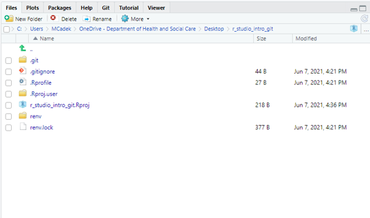

```{r setup, include=FALSE}
knitr::opts_chunk$set(echo = FALSE)
```

## Content
1. Part - Introduction
2. Part - Basics
3. Part - Advancing Further

## Part I - Introduction


## What's an IDE?
- An integrated development environment (IDE) is a software application that provides comprehensive facilities to computer programmers for software development

- Examples of IDE’s for R language:
     - [RStudio](https://www.rstudio.com/)
     - [Visual Studio Code](https://code.visualstudio.com/) + [Plugin](https://marketplace.visualstudio.com/items?itemName=Ikuyadeu.r)
     - [Vim](https://www.vim.org/) + [Plugin](https://github.com/jalvesaq/Nvim-R)
     - [Atom](https://atom.io/)
     - [Others](https://en.wikipedia.org/wiki/Comparison_of_integrated_development_environments#R)

- IDE ≠ GUI (Graphical User Interface)

## Builds/Platforms
- RStudio versions (builds) – [stable](https://www.rstudio.com/products/rstudio/download/), [preview](https://www.rstudio.com/products/rstudio/download/preview/), [daily](https://dailies.rstudio.com/)
- Platforms
     - RStudio Desktop: Open Source Edition / Pro Edition
     - RStudio Server (Cloud): Open Source Edition / RStudio Workbench (Pro)

## Installation


## Installation


## Part II - Basics

## Basics
I will cover the following topics:

1. Going through core functionality of the IDE
2. Explaining projects
3. Introducing panes and basic features
4. Global options

Each will be presented interactively in RStudio IDE.

## Basic RStudio Layout


## RStudio Basics & Projects
1. RStudio layout features 4 customisable quadrants
2. Creating RStudio project files (.Rproj)
3. Managing projects from within RStudio (creating files / folders)
4. Opening from .Rproj (different ways)
5. Creating and running scripts
6. Sourcing scripts
7. Introducing the rest of the panes
8. Discussing \+ and - of RStudio projects

## Setting Global Options
1. General - Default CRAN mirror, initial working directory, workspace and history behaviour.
2. Code - Enable/disable line numbers, selected word and line highlighting, soft-wrapping for R files, parenthesis matching, right margin display, and console syntax highlighting; configure tab spacing; set default text encoding.
3. Appearance - Specify font size and visual theme for the console and source editor.
4. Panes - Locations of console, source editor, and tab panes; set which tabs are included in each pane.
5. Packages - Set default CRAN repository and specify package development options.
6. R Markdown - Reporting options for Markdown.

## Setting Global Options
7. Sweave - Configure Sweave compiling options and PDF previewing.
8. Spelling - Choose main dictionary language and specify spell checking options.
9. Git - Configure locations of Git and SVN binaries and create and/or view SSH RSA keys.
10. Publishing - Enable publishing apps and documents from IDE. Set account.
11. Terminal - Configuring command line.
12. Accessibility - Making use of the assistive tools available in RStudio. 

More information [here](https://support.rstudio.com/hc/en-us/articles/200549016-Customizing-RStudio).

## Part III – Advancing Further

## Tips & Trics
- CTRL + ENTER
- ALT + MOUSE
- Changing Version of R while opening RStudio 
- Autocompletion:
     - Fuzzy matching, skipping letter
     - Path search
- Code snippets (e.g., fun, shift + tab)
- Command history (CTRL+UP)
- Find Files/Functions (CTRL+.)
- Find Files (CTRL + SHIFT + F)
- File -> Close All
- Keyboard Shortcuts (Shift + Alt + K)
- For more, follow [twitter rstudiotips](https://twitter.com/rstudiotips)

## Extending RStudio with Add-ins
- Powerful extensions expanding core functionality of RStudio
- Keep the core of the IDE clean (i.e., no visual clutter)
- Easy to install
- Written in R (part of R packages)
- Examples:
     - Installing Add-ins
     - Using
     - Binding
- https://github.com/daattali/addinslist

## GIT Projects


## GIT Projects


## R Markdown Projects
- Markdown is a simple formatting syntax for authoring HTML, PDF, and MS Word documents.
- A plain text file and can be tracked on Git, modified outside proprietary software.
- For more details on using R Markdown see:
     - http://rmarkdown.rstudio.com
     - https://m-clark.github.io/Introduction-to-Rmarkdown/introduction.html

## Notebook Projects
- Similar to RMarkdown but can Preview files, but offers:
     - Real-time previews (e.g. equations)
     - Handles more than one output (gallery views)
     - Can handle multiple languages (e.g. SQL, Python)
     - html_notebook output type (preview note: unlike knitting it does note re-run the code)
- Otherwise a plain text file

## There's more!
- [Presentations](https://support.rstudio.com/hc/en-us/articles/200486468-Authoring-R-Presentations) Projects (like this one :) )
- [Shiny](https://shiny.rstudio.com/) Projects
- [Package](https://support.rstudio.com/hc/en-us/articles/200486488-Developing-Packages-with-RStudio) development
- [Documentation](https://support.rstudio.com/hc/en-us/articles/200532317-Writing-Package-Documentation)
- SQL, Python, D3 scripts
- and more...       

## References & Resources
- https://www.youtube.com/watch?v=kuSQgswZdr8
- https://github.com/rstudio/cheatsheets/raw/master/rstudio-ide.pdf
- https://rladiessydney.org/courses/ryouwithme/01-basicbasics-1/
- https://bookdown.org/yihui/rmarkdown/
- https://support.rstudio.com/hc/en-us/articles/200549016-Customizing-RStudio

## Thank you!