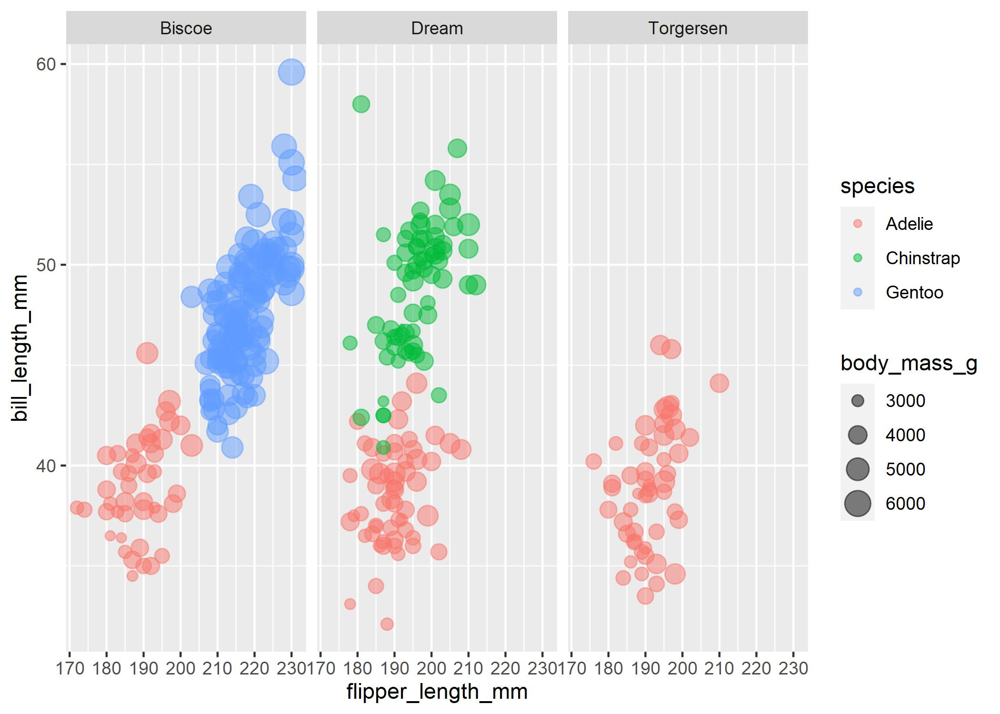
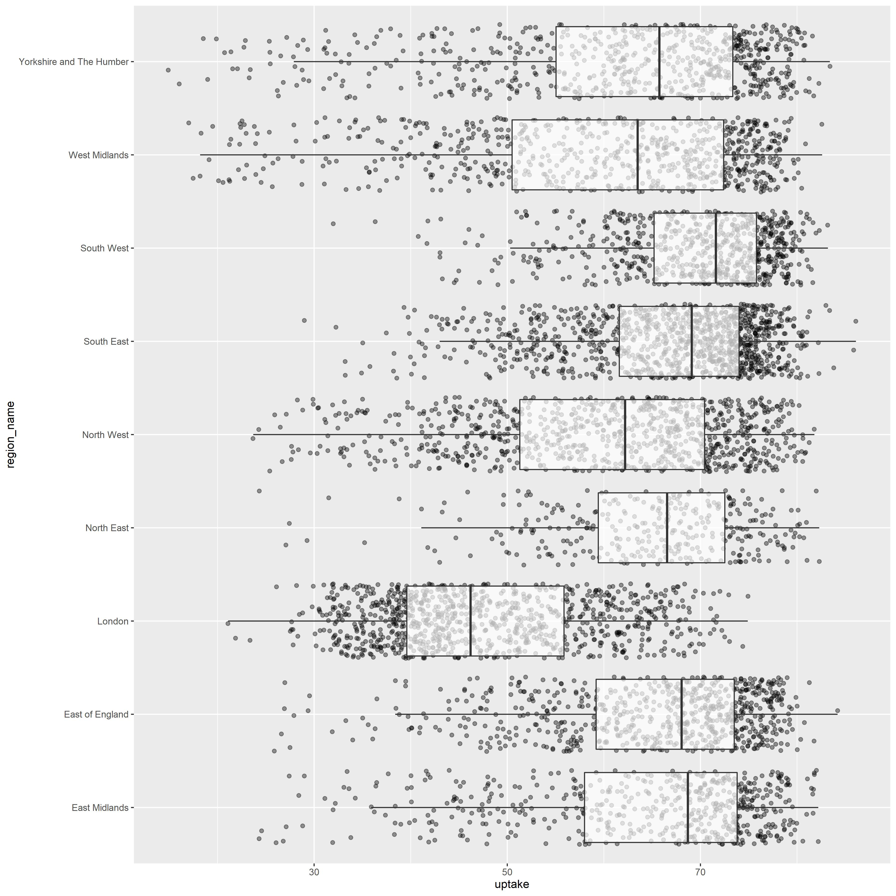
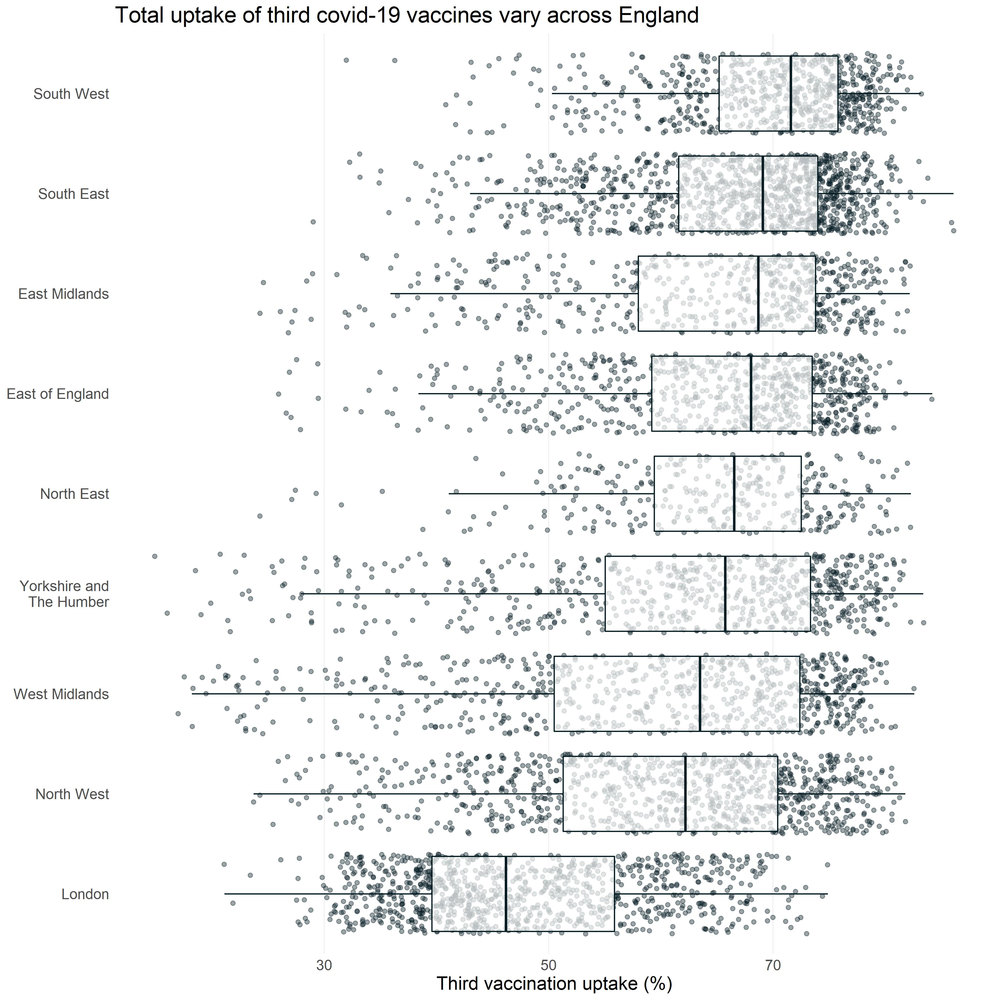

```{r message=FALSE, warning=FALSE}
if (!require("pacman")) install.packages("pacman")

pacman::p_load(
  tidyverse, 
  data.table, # fast csv read/write
  janitor, # clean_names()
  scales, # comma()
  Cairo, # better anti-aliasing when saving images
  ggtext, # for markdown text
  ggdist, # for many distribution geoms
  palmerpenguins # example dataset on penguins
)
```

Below, we'll visualise the palmer penguins dataset to introduce the basics of [ggplot2](https://ggplot2.tidyverse.org/).
```{r warning=FALSE}
penguins
```

Firstly, we use ggplot2 to plot a basic scatter plot of flipper length against bill length.
<br />
We define 2 aesthetics with `aes()` as the x and y coordinates, then one geometric object with `geom_point()` to plot these coordinates as points. 
<br />
<br />
Extra things to note:
<br />
*The x and y coordinates can also be specified by using `x =` and `y =` but this is not required because ggplot2 assumes that the first two arguments after data will be x and y aesthetics, respectively.*
<br />
*Awkwardly, the `+` pipe is used after the `ggplot()` function, as the `%>%` pipe was developed after ggplot2.*


```{r, warning = FALSE}
penguins %>%
  ggplot(aes(flipper_length_mm, bill_length_mm)) +
  geom_point()
```

We can now define `colour` by including it as another aesthetic inside `aes()`.
```{r, warning = FALSE}
penguins %>%
  ggplot(aes(flipper_length_mm, bill_length_mm,
             colour = species)) +
  geom_point()
```

The same can be done with the `size` aesthetic.
```{r, warning = FALSE}
penguins %>%
  ggplot(aes(flipper_length_mm, bill_length_mm,
             colour = species,
             size = body_mass_g)) +
  geom_point()
```

The `alpha` (transparency) of the points can also be set as an aesthetic, or just manually to 50% as we do here.
```{r, warning = FALSE}
penguins %>%
  ggplot(aes(flipper_length_mm, bill_length_mm,
             colour = species,
             size = body_mass_g)) +
  geom_point(alpha = 0.5)
```


The plot can be split by a categorical/factor variable into facets using `facet_wrap()`.
```{r, warning = FALSE}
penguins %>%
  ggplot(aes(flipper_length_mm, bill_length_mm,
             colour = species,
             size = body_mass_g)) +
  geom_point(alpha = 0.5) +
  facet_wrap(~island)
```

This plot can be saved using the `ggsave()` function.
```{r, warning = FALSE}
ggsave(dpi = 300, width = 7, height = 5, units = "in", type = "cairo",
       filename = "outputs/penguins5.jpeg")
```



# Example using ggplot2 with covid vaccination data

Example MSOA level covid data - https://coronavirus.data.gov.uk/details/download
```{r, message=FALSE, warning=FALSE}
vaccines <- fread("https://api.coronavirus.data.gov.uk/v2/data?areaType=msoa&metric=cumVaccinationThirdInjectionUptakeByVaccinationDatePercentage&format=csv") %>% 
  clean_names() %>% 
  rename(uptake = cum_vaccination_third_injection_uptake_by_vaccination_date_percentage) %>% 
  select(region_name,
         area_name,
         uptake)
```

Plot the % vaccine uptake for each MSOA, split across the regions of England using `geom_point()`.
```{r, message=FALSE, warning=FALSE}
dist_1 <- vaccines %>% 
  ggplot(aes(uptake, region_name)) + 
  geom_point()

ggsave(dist_1, dpi = 300, width = 12, height = 12, units = "in", type = "cairo",
       filename = "outputs/dist_1.jpeg")
```


Replace geom_point() with `geom_jitter()` to randomly “jitter” the points and reduce overplotting.
```{r, message=FALSE, warning=FALSE}
dist_2 <- vaccines %>% 
  ggplot(aes(uptake, region_name)) + 
  geom_jitter()

ggsave(dist_2, dpi = 300, width = 12, height = 12, units = "in", type = "cairo",
       filename = "outputs/dist_2.jpeg")
```


Set point transparency to 40% to reduce overplotting further.
```{r, message=FALSE, warning=FALSE}
dist_3 <- vaccines %>% 
  ggplot(aes(uptake, region_name)) + 
  geom_jitter(alpha = 0.4)

ggsave(dist_3, dpi = 300, width = 12, height = 12, units = "in", type = "cairo",
       filename = "outputs/dist_3.jpeg")
```


Add boxplots with `geom_boxplot()`.
```{r message=FALSE, warning=FALSE}
dist_4 <- vaccines %>% 
  ggplot(aes(uptake, region_name)) + 
  geom_jitter(alpha = 0.4) + 
  geom_boxplot()

ggsave(dist_4, dpi = 300, width = 12, height = 12, units = "in", type = "cairo",
       filename = "outputs/dist_4.jpeg")
```


Set boxplot transparency and remove duplicate outliers.
```{r, message=FALSE, warning=FALSE}
dist_5 <- vaccines %>% 
  ggplot(aes(uptake, region_name)) + 
  geom_jitter(alpha = 0.4) + 
  geom_boxplot(alpha = 0.7, outlier.shape = NA)

ggsave(dist_5, dpi = 300, width = 12, height = 12, units = "in", type = "cairo",
       filename = "outputs/dist_5.jpeg")
```


Increase text size with `theme()`.
```{r, message=FALSE, warning=FALSE}
dist_6 <- vaccines %>% 
  ggplot(aes(uptake, region_name)) + 
  geom_jitter(alpha = 0.4) + 
  geom_boxplot(alpha = 0.7, outlier.shape = NA) + 
  theme(text = element_text(size = 16))

ggsave(dist_6, dpi = 300, width = 12, height = 12, units = "in", type = "cairo",
       filename = "outputs/dist_6.jpeg")
```


Order by median % uptake.
```{r, message=FALSE, warning=FALSE}
dist_7 <- vaccines %>% 
  group_by(region_name) %>% 
  mutate(uptake_m = median(uptake, na.rm = TRUE)) %>% 
  ungroup() %>% 
  ggplot(aes(uptake, fct_reorder(region_name, uptake_m))) + 
  geom_jitter(alpha = 0.4) + 
  geom_boxplot(alpha = 0.7, outlier.shape = NA) + 
  theme(text = element_text(size = 16))

ggsave(dist_7, dpi = 300, width = 12, height = 12, units = "in", type = "cairo",
       filename = "outputs/dist_7.jpeg")
```


Change some colours to suit an DHSC style and declutter by altering `theme()` to remove extra gridlines, remove axis ticks, and change the background to white.
```{r, message=FALSE, warning=FALSE}
dist_8 <- vaccines %>% 
  group_by(region_name) %>% 
  mutate(uptake_m = median(uptake, na.rm = TRUE)) %>% 
  ungroup() %>% 
  ggplot(aes(uptake, fct_reorder(region_name, uptake_m))) + 
  geom_jitter(colour = "#061C23", alpha = 0.4) + 
  geom_boxplot(colour = "#061C23", alpha = 0.7, outlier.shape = NA) + 
  theme(panel.background = element_rect(fill = "white", colour = NA),
        plot.background = element_rect(fill = "white", colour = NA),
        text = element_text(size = 16),
        panel.grid.major.x = element_line(colour = "grey95"),
        axis.ticks = element_blank())

ggsave(dist_8, dpi = 300, width = 12, height = 12, units = "in", type = "cairo",
       filename = "outputs/dist_8.jpeg")
```


Add a title and correct axis text with `labs()`.
```{r, message=FALSE, warning=FALSE}
dist_9 <- vaccines %>% 
    mutate(region_name = case_when(
    region_name == "Yorkshire and The Humber" ~
      "Yorkshire and\nThe Humber",
    TRUE ~ as.character(region_name))) %>%
  group_by(region_name) %>% 
  mutate(uptake_m = median(uptake, na.rm = TRUE)) %>% 
  ungroup() %>% 
  ggplot(aes(uptake, fct_reorder(region_name, uptake_m))) + 
  geom_jitter(colour = "#061C23", alpha = 0.4) + 
  geom_boxplot(colour = "#061C23", alpha = 0.7, outlier.shape = NA) + 
  labs(x = "Third vaccination uptake (%)",
       y = NULL,
       title = "Total uptake of third covid-19 vaccines vary across England") + 
  theme(panel.background = element_rect(fill = "white", colour = NA),
        plot.background = element_rect(fill = "white", colour = NA),
        text = element_text(size = 16),
        panel.grid.major.x = element_line(colour = "grey95"),
        axis.ticks = element_blank())

ggsave(dist_9, dpi = 300, width = 12, height = 12, units = "in", type = "cairo",
       filename = "outputs/dist_9.jpeg")
```


Alter axis and margin spacings with `scale_x_continuous()`, `scale_y_discrete()`, and `theme()`.
```{r, message=FALSE, warning=FALSE}
dist_10 <- vaccines %>% 
    mutate(region_name = case_when(
    region_name == "Yorkshire and The Humber" ~
      "Yorkshire and\nThe Humber",
    TRUE ~ as.character(region_name))) %>%
  group_by(region_name) %>% 
  mutate(uptake_m = median(uptake, na.rm = TRUE)) %>% 
  ungroup() %>% 
  ggplot(aes(uptake, fct_reorder(region_name, uptake_m))) + 
  geom_jitter(colour = "#061C23", alpha = 0.4) + 
  geom_boxplot(colour = "#061C23", alpha = 0.7, outlier.shape = NA) + 
  scale_x_continuous(expand = c(0.01, 0.01)) + 
  scale_y_discrete(expand = c(0.05, 0)) + 
  labs(x = "Third vaccination uptake (%)",
       y = NULL,
       title = "Total uptake of third covid-19 vaccines vary across England") + 
  theme(panel.background = element_rect(fill = "white", colour = NA),
        plot.background = element_rect(fill = "white", colour = NA),
        axis.ticks = element_blank(),
        panel.grid.major.x = element_line(colour = "grey95"), 
        text = element_text(size = 16),
        plot.title.position = "plot",
        plot.margin = margin(10, 10, 10, 10))

ggsave(dist_10, dpi = 300, width = 12, height = 12, units = "in", type = "cairo",
       filename = "outputs/dist_10.jpeg")
```


Increase text size further, change font, and alter colours with `theme()`.
```{r, message=FALSE, warning=FALSE}
dist_11 <- vaccines %>% 
    mutate(region_name = case_when(
    region_name == "Yorkshire and The Humber" ~
      "Yorkshire and\nThe Humber",
    TRUE ~ as.character(region_name))) %>%
  group_by(region_name) %>% 
  mutate(uptake_m = median(uptake, na.rm = TRUE)) %>% 
  ungroup() %>% 
  ggplot(aes(uptake, fct_reorder(region_name, uptake_m))) + 
  geom_jitter(colour = "#061C23", alpha = 0.4) + 
  geom_boxplot(colour = "#061C23", alpha = 0.7, outlier.shape = NA) + 
  scale_x_continuous(expand = c(0.01, 0.01)) + 
  scale_y_discrete(expand = c(0.05, 0)) + 
  labs(x = "Third vaccination uptake (%)",
       y = NULL,
       title = "Total uptake of third covid-19 vaccines vary across England") + 
  theme(panel.background = element_rect(fill = "white", colour = NA),
        plot.background = element_rect(fill = "white", colour = NA),
        axis.ticks = element_blank(),
        panel.grid.major.x = element_line(colour = "grey95"), 
        text = element_text(family = "sans", colour = "#061C23",
                            face = "bold", size = 16),
        axis.text.y = element_text(family = "sans", colour = "#061C23", 
                                   face = "bold", size = 16),
        plot.title.position = "plot",
        plot.title = element_text(family = "sans", colour = "#061C23", 
                                   face = "bold", size = 29),
        plot.margin = margin(10, 10, 10, 10))

ggsave(dist_11, dpi = 300, width = 12, height = 12, units = "in", type = "cairo",
       filename = "outputs/dist_11.jpeg")
```


Replace the points and boxplots with `stat_dots()` from the ggdist package.
```{r, message=FALSE, warning=FALSE}
dist_12 <- vaccines %>% 
    mutate(region_name = case_when(
    region_name == "Yorkshire and The Humber" ~
      "Yorkshire and\nThe Humber",
    TRUE ~ as.character(region_name))) %>%
  group_by(region_name) %>% 
  mutate(uptake_m = median(uptake, na.rm = TRUE)) %>% 
  ungroup() %>% 
  ggplot(aes(uptake, fct_reorder(region_name, uptake_m))) + 
  stat_dots(colour = "#061C23", side = "top", scale = 0.74, shape = 15) + 
  scale_x_continuous(expand = c(0.01, 0.01)) + 
  scale_y_discrete(expand = c(0.05, 0)) + 
  labs(x = "Third vaccination uptake (%)",
       y = NULL,
       title = "Total uptake of third covid-19 vaccines vary across England") + 
  theme(panel.background = element_rect(fill = "white", colour = NA),
        plot.background = element_rect(fill = "white", colour = NA),
        axis.ticks = element_blank(),
        panel.grid.major.x = element_line(colour = "grey95"), 
        text = element_text(family = "sans", colour = "#061C23",
                            face = "bold", size = 16),
        axis.text.y = element_text(family = "sans", colour = "#061C23", 
                                   face = "bold", size = 16),
        plot.title.position = "plot",
        plot.title = element_text(family = "sans", colour = "#061C23", 
                                   face = "bold", size = 29),
        plot.margin = margin(10, 10, 10, 10))

ggsave(dist_12, dpi = 300, width = 12, height = 12, units = "in", type = "cairo",
       filename = "outputs/dist_12.jpeg")
```


Include `stat_interval()` to indicate where 25%, 50%, 95%, and 100% of the MSOAs lie.
```{r, message=FALSE, warning=FALSE}
dist_13 <- vaccines %>% 
    mutate(region_name = case_when(
    region_name == "Yorkshire and The Humber" ~
      "Yorkshire and\nThe Humber",
    TRUE ~ as.character(region_name))) %>%
  group_by(region_name) %>% 
  mutate(uptake_m = median(uptake, na.rm = TRUE)) %>% 
  ungroup() %>% 
  ggplot(aes(uptake, fct_reorder(region_name, uptake_m))) + 
  stat_dots(colour = "#061C23", side = "top", scale = 0.74, shape = 15) + 
  stat_interval(aes(color_ramp = stat(level)),
                .width = c(0.25, 0.5, 0.95, 1),
                position = position_dodge(width = 0.15, preserve = "single")) + 
  scale_x_continuous(expand = c(0.01, 0.01)) + 
  scale_y_discrete(expand = c(0.05, 0)) + 
  scale_colour_manual(values = c("grey78", "#79BDD3", "#4CA7C4", "#2092B6")) + 
  labs(x = "Third vaccination uptake (%)",
       y = NULL,
       title = "Total uptake of third covid-19 vaccines vary across England") + 
  theme(panel.background = element_rect(fill = "white", colour = NA),
        plot.background = element_rect(fill = "white", colour = NA),
        axis.ticks = element_blank(),
        panel.grid.major.x = element_line(colour = "grey95"), 
        text = element_text(family = "sans", colour = "#061C23",
                            face = "bold", size = 16),
        axis.text.y = element_text(family = "sans", colour = "#061C23", 
                                   face = "bold", size = 16),
        plot.title.position = "plot",
        plot.title = element_text(family = "sans", colour = "#061C23", 
                                   face = "bold", size = 29),
        plot.margin = margin(10, 10, 10, 10))

ggsave(dist_13, dpi = 300, width = 12, height = 12, units = "in", type = "cairo",
       filename = "outputs/dist_13.jpeg")
```


Declutter by replacing the legend with a colour coded subtitle, using the ggtext package.
```{r, message=FALSE, warning=FALSE}
dist_14 <- vaccines %>% 
    mutate(region_name = case_when(
    region_name == "Yorkshire and The Humber" ~
      "Yorkshire and\nThe Humber",
    TRUE ~ as.character(region_name))) %>%
  group_by(region_name) %>% 
  mutate(uptake_m = median(uptake, na.rm = TRUE)) %>% 
  ungroup() %>% 
  ggplot(aes(uptake, fct_reorder(region_name, uptake_m))) + 
  stat_dots(colour = "#061C23", side = "top", scale = 0.74, shape = 15) + 
  stat_interval(aes(color_ramp = stat(level)),
                .width = c(0.25, 0.5, 0.95, 1),
                position = position_dodge(width = 0.15, preserve = "single")) + 
  scale_x_continuous(expand = c(0.01, 0.01)) + 
  scale_y_discrete(expand = c(0.05, 0)) + 
  scale_colour_manual(values = c("grey78", "#79BDD3", "#4CA7C4", "#2092B6")) + 
  labs(x = "Third vaccination uptake (%)",
       y = NULL,
       title = "Total uptake of third covid-19 vaccines vary across England",
       subtitle = "The triangles indicate the median vaccine uptake of MSOAs in 
       each region. Each square represents one MSOA. The interval stripes 
       indicate the ranges in which 
       **<span style='color:#2092B6;'>25%</span>**, 
       **<span style='color:#4CA7C4;'>50%</span>**, 
       **<span style='color:#79BDD3;'>95%</span>**, and
       **<span style='color:grey78;'>100%</span>** of the MSOAs fall.") + 
  theme(legend.position = "none",
        panel.background = element_rect(fill = "white", colour = NA),
        plot.background = element_rect(fill = "white", colour = NA),
        axis.ticks = element_blank(),
        panel.grid.major.x = element_line(colour = "grey95"), 
        text = element_text(family = "sans", colour = "#061C23",
                            face = "bold", size = 16),
        axis.text.y = element_text(family = "sans", colour = "#061C23", 
                                   face = "bold", size = 16),
        plot.title.position = "plot",
        plot.title = element_text(family = "sans", colour = "#061C23", 
                                   face = "bold", size = 29),
        plot.subtitle = element_textbox_simple(family = "sans", face = "bold", 
                                               size = 16,
                                               margin = margin(10, 0, -15, 0)),
        plot.margin = margin(10, 10, 10, 10))

ggsave(dist_14, dpi = 300, width = 12, height = 12, units = "in", type = "cairo",
       filename = "outputs/dist_14.jpeg")
```


Add `geom_point()` to plot the median values only.
```{r, message=FALSE, warning=FALSE}
dist_15 <- vaccines %>% 
    mutate(region_name = case_when(
    region_name == "Yorkshire and The Humber" ~
      "Yorkshire and\nThe Humber",
    TRUE ~ as.character(region_name))) %>%
  group_by(region_name) %>% 
  mutate(uptake_m = median(uptake, na.rm = TRUE)) %>% 
  ungroup() %>% 
  ggplot(aes(uptake, fct_reorder(region_name, uptake_m))) + 
  stat_dots(colour = "#061C23", side = "top", scale = 0.74, shape = 15) + 
  stat_interval(aes(color_ramp = stat(level)),
                .width = c(0.25, 0.5, 0.95, 1),
                position = position_dodge(width = 0.15, preserve = "single")) + 
  geom_point(aes(uptake_m, fct_reorder(region_name, uptake_m)),
             size = 5, colour = "#061C23") + 
  scale_x_continuous(expand = c(0.01, 0.01)) + 
  scale_y_discrete(expand = c(0.05, 0)) + 
  scale_colour_manual(values = c("grey78", "#79BDD3", "#4CA7C4", "#2092B6")) + 
  labs(x = "Third vaccination uptake (%)",
       y = NULL,
       title = "Total uptake of third covid-19 vaccines vary across England",
       subtitle = "The triangles indicate the median vaccine uptake of MSOAs in 
       each region. Each square represents one MSOA. The interval stripes 
       indicate the ranges in which 
       **<span style='color:#2092B6;'>25%</span>**, 
       **<span style='color:#4CA7C4;'>50%</span>**, 
       **<span style='color:#79BDD3;'>95%</span>**, and
       **<span style='color:grey78;'>100%</span>** of the MSOAs fall.") + 
  theme(legend.position = "none",
        panel.background = element_rect(fill = "white", colour = NA),
        plot.background = element_rect(fill = "white", colour = NA),
        axis.ticks = element_blank(),
        panel.grid.major.x = element_line(colour = "grey95"), 
        text = element_text(family = "sans", colour = "#061C23",
                            face = "bold", size = 16),
        axis.text.y = element_text(family = "sans", colour = "#061C23", 
                                   face = "bold", size = 16),
        plot.title.position = "plot",
        plot.title = element_text(family = "sans", colour = "#061C23", 
                                   face = "bold", size = 29),
        plot.subtitle = element_textbox_simple(family = "sans", face = "bold", 
                                               size = 16,
                                               margin = margin(10, 0, -15, 0)),
        plot.margin = margin(10, 10, 10, 10))

ggsave(dist_15, dpi = 300, width = 12, height = 12, units = "in", type = "cairo",
       filename = "outputs/dist_15.jpeg")
```


Alter the median point shape and position.
```{r, message=FALSE, warning=FALSE}
dist_16 <- vaccines %>% 
    mutate(region_name = case_when(
    region_name == "Yorkshire and The Humber" ~
      "Yorkshire and\nThe Humber",
    TRUE ~ as.character(region_name))) %>%
  group_by(region_name) %>% 
  mutate(uptake_m = median(uptake, na.rm = TRUE)) %>% 
  ungroup() %>% 
  ggplot(aes(uptake, fct_reorder(region_name, uptake_m))) + 
  stat_dots(colour = "#061C23", side = "top", scale = 0.74, shape = 15) + 
  stat_interval(aes(color_ramp = stat(level)),
                .width = c(0.25, 0.5, 0.95, 1),
                position = position_dodge(width = 0.15, preserve = "single")) + 
  geom_point(aes(uptake_m, fct_reorder(region_name, uptake_m)),
             shape = 17, size = 5, colour = "#061C23",
             position = position_dodge(width = 0.42, preserve = "single")) + 
  scale_x_continuous(expand = c(0.01, 0.01)) + 
  scale_y_discrete(expand = c(0.05, 0)) + 
  scale_colour_manual(values = c("grey78", "#79BDD3", "#4CA7C4", "#2092B6")) + 
  labs(x = "Third vaccination uptake (%)",
       y = NULL,
       title = "Total uptake of third covid-19 vaccines vary across England",
       subtitle = "The triangles indicate the median vaccine uptake of MSOAs in 
       each region. Each square represents one MSOA. The interval stripes 
       indicate the ranges in which 
       **<span style='color:#2092B6;'>25%</span>**, 
       **<span style='color:#4CA7C4;'>50%</span>**, 
       **<span style='color:#79BDD3;'>95%</span>**, and
       **<span style='color:grey78;'>100%</span>** of the MSOAs fall.") + 
  theme(legend.position = "none",
        panel.background = element_rect(fill = "white", colour = NA),
        plot.background = element_rect(fill = "white", colour = NA),
        axis.ticks = element_blank(),
        panel.grid.major.x = element_line(colour = "grey95"), 
        text = element_text(family = "sans", colour = "#061C23",
                            face = "bold", size = 16),
        axis.text.y = element_text(family = "sans", colour = "#061C23", 
                                   face = "bold", size = 16),
        plot.title.position = "plot",
        plot.title = element_text(family = "sans", colour = "#061C23", 
                                   face = "bold", size = 29),
        plot.subtitle = element_textbox_simple(family = "sans", face = "bold", 
                                               size = 16,
                                               margin = margin(10, 0, -15, 0)),
        plot.margin = margin(10, 10, 10, 10))

ggsave(dist_16, dpi = 300, width = 12, height = 12, units = "in", type = "cairo",
       filename = "outputs/dist_16.jpeg")
```


Add `geom_text()` labels to include the counts of MSOAs.
```{r, message=FALSE, warning=FALSE}
dist_17 <- vaccines %>% 
    mutate(region_name = case_when(
    region_name == "Yorkshire and The Humber" ~
      "Yorkshire and\nThe Humber",
    TRUE ~ as.character(region_name))) %>%
  group_by(region_name) %>% 
  mutate(uptake_m = median(uptake, na.rm = TRUE),
         count = n()) %>% 
  ungroup() %>% 
  ggplot(aes(uptake, fct_reorder(region_name, uptake_m))) + 
  stat_dots(colour = "#061C23", side = "top", scale = 0.74, shape = 15) + 
  stat_interval(aes(color_ramp = stat(level)),
                .width = c(0.25, 0.5, 0.95, 1),
                position = position_dodge(width = 0.15, preserve = "single")) + 
  geom_text(aes(uptake_m,
                as.numeric(fct_reorder(region_name, uptake_m)) - 0.185,
                label = paste0(
                  "   ", 
                  comma(round_half_up(uptake_m, 0), accuracy = 1),
                  "% (", comma(count, accuracy = 1), " MSOAs)"
                )),
            fontface = "bold", size = 12/.pt, colour = "#061C23",
            hjust = 0, check_overlap = TRUE) + 
  geom_point(aes(uptake_m, fct_reorder(region_name, uptake_m)),
             shape = 17, size = 5, colour = "#061C23",
             position = position_dodge(width = 0.42, preserve = "single")) + 
  scale_x_continuous(expand = c(0.01, 0.01)) + 
  scale_y_discrete(expand = c(0.05, 0)) + 
  scale_colour_manual(values = c("grey78", "#79BDD3", "#4CA7C4", "#2092B6")) + 
  labs(x = "Third vaccination uptake (%)",
       y = NULL,
       title = "Total uptake of third covid-19 vaccines vary across England",
       subtitle = "The triangles indicate the median vaccine uptake of MSOAs in 
       each region. Each square represents one MSOA. The interval stripes 
       indicate the ranges in which 
       **<span style='color:#2092B6;'>25%</span>**, 
       **<span style='color:#4CA7C4;'>50%</span>**, 
       **<span style='color:#79BDD3;'>95%</span>**, and
       **<span style='color:grey78;'>100%</span>** of the MSOAs fall.") + 
  theme(legend.position = "none",
        panel.background = element_rect(fill = "white", colour = NA),
        plot.background = element_rect(fill = "white", colour = NA),
        axis.ticks = element_blank(),
        panel.grid.major.x = element_line(colour = "grey95"), 
        text = element_text(family = "sans", colour = "#061C23",
                            face = "bold", size = 16),
        axis.text.y = element_text(family = "sans", colour = "#061C23", 
                                   face = "bold", size = 16),
        plot.title.position = "plot",
        plot.title = element_text(family = "sans", colour = "#061C23", 
                                   face = "bold", size = 29),
        plot.subtitle = element_textbox_simple(family = "sans", face = "bold", 
                                               size = 16,
                                               margin = margin(10, 0, -15, 0)),
        plot.margin = margin(10, 10, 10, 10))

ggsave(dist_17, dpi = 300, width = 12, height = 12, units = "in", type = "cairo",
       filename = "outputs/dist_17.jpeg")
```


Declutter by removing the x axis entirely. Was this a good idea?
```{r, message=FALSE, warning=FALSE}
dist18 <- vaccines %>% 
  mutate(region_name = case_when(
    region_name == "Yorkshire and The Humber" ~
      "Yorkshire and\nThe Humber",
    TRUE ~ as.character(region_name))) %>%
  group_by(region_name) %>% 
  mutate(uptake_m = median(uptake, na.rm = TRUE),
         count = n()) %>% 
  ungroup() %>% 
  ggplot(aes(uptake, fct_reorder(region_name, uptake_m))) + 
  stat_dots(colour = "#061C23", side = "top", scale = 0.74, shape = 15) + 
  stat_interval(aes(color_ramp = stat(level)),
                .width = c(0.25, 0.5, 0.95, 1), 
                position = position_dodge(width = 0.15, preserve = "single")) + 
  geom_text(aes(uptake_m,
                as.numeric(fct_reorder(region_name, uptake_m)) - 0.185,
                label = paste0(
                  "   ", 
                  comma(round_half_up(uptake_m, 0), accuracy = 1),
                  "% (", comma(count, accuracy = 1), " MSOAs)"
                )),
            fontface = "bold", size = 12/.pt, colour = "#061C23",
            hjust = 0, check_overlap = TRUE) + 
  geom_point(aes(uptake_m, fct_reorder(region_name, uptake_m)),
             shape = 17, size = 5, colour = "#061C23",
             position = position_dodge(width = 0.42, preserve = "single")) + 
  scale_x_continuous(expand = c(0.01, 0.01)) + 
  scale_y_discrete(expand = c(0.05, 0)) + 
  scale_colour_manual(values = c("grey78", "#79BDD3", "#4CA7C4", "#2092B6")) + 
  labs(x = NULL,
       y = NULL,
       title = "Total uptake of third covid-19 vaccines vary across England",
       subtitle = "The triangles indicate the median vaccine uptake of MSOAs in 
       each region. Each square represents one MSOA. The interval stripes 
       indicate the ranges in which 
       **<span style='color:#2092B6;'>25%</span>**, 
       **<span style='color:#4CA7C4;'>50%</span>**, 
       **<span style='color:#79BDD3;'>95%</span>**, and
       **<span style='color:grey78;'>100%</span>** of the MSOAs fall.") + 
  theme(legend.position = "none",
        panel.background = element_rect(fill = "white", colour = NA),
        plot.background = element_rect(fill = "white", colour = NA),
        axis.text.x = element_blank(),
        axis.ticks = element_blank(),
        axis.text.y = element_text(family = "sans", colour = "#061C23", 
                                   face = "bold", size = 16),
        plot.title.position = "plot",
        plot.title = element_text(family = "sans", colour = "#061C23",
                                  face = "bold", size = 29),
        plot.subtitle = element_textbox_simple(family = "sans", face = "bold", 
                                               size = 16,
                                               margin = margin(10, 0, -15, 0)),
        plot.margin = margin(10, 10, 10, 10))


ggsave(dist18, dpi = 300, width = 12, height = 12, units = "in", type = "cairo",
       filename = "outputs/dist18.jpeg")
```


